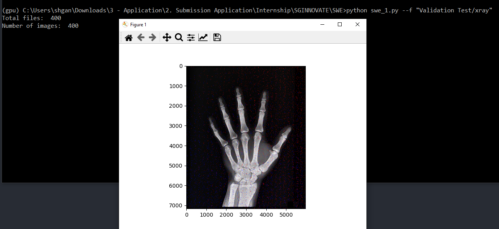
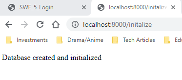
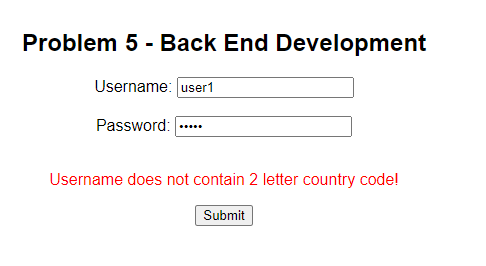
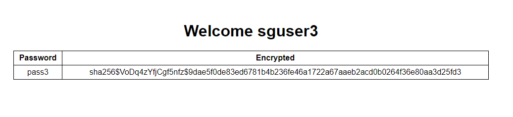

# STARS@SGINNOVATE

## About this repository
This repository contains the code for the STARS@SGINNOVATE assessments. 

The below table despicts the folders for the respective tests.
| Assessment | Folder  | 
| ------------- |:-------------:| 
| AI Scientist (Computer Vision) Assessment| CV|
| Software Engineer Assessment| SWE | 

---

## AI Scientist (Computer Vision) Assessment
### Question 2 
- File: `CV/TSN.ipynb`
I do not have much experience working with video data as my pass experiences have been mostly with images. In this question, I have used the pretrained model in `GLUON` to implement Temporal Segment Network (TSN) for video classification. 

---

## Software Engineer Assessment
### Question 1
#### Usage
- Considerations
    - All images in the folder are in `.jpg` format
    - All images have the same dimensions (height, weight)
    - All images should have at least 1 red and blue circles
- Raise Exceptions:
    - Folder does not exist
    - Number of files in the folder is `not equal` to images detected
```sh
cd SWE
python swe_1.py --f "./filepath/foldername"
```
### Screenshots


### Question 2
#### Usage
1. Run flask app at port 8000
    ```sh
    cd SWE
    python swe_5.py
    ```
2. Initailize database if not already done by running the end point: `http://localhost:8000/initalize`
    - Create/overwrite the database `user.db`
    - Insert dummy data in DB based on `SWE/static/credentials.json`
    - 
3. Start the frontend by accessing `http://localhost:8000/`
    - Username and password is based on `SWE/static/credentials.json`
4. Login
    - username does not contain 2 letter country code **(based on ip address location)**
    - user does not exist or wrong password
    - Database not initialized
    - Username and password are blank

### Screenshots


